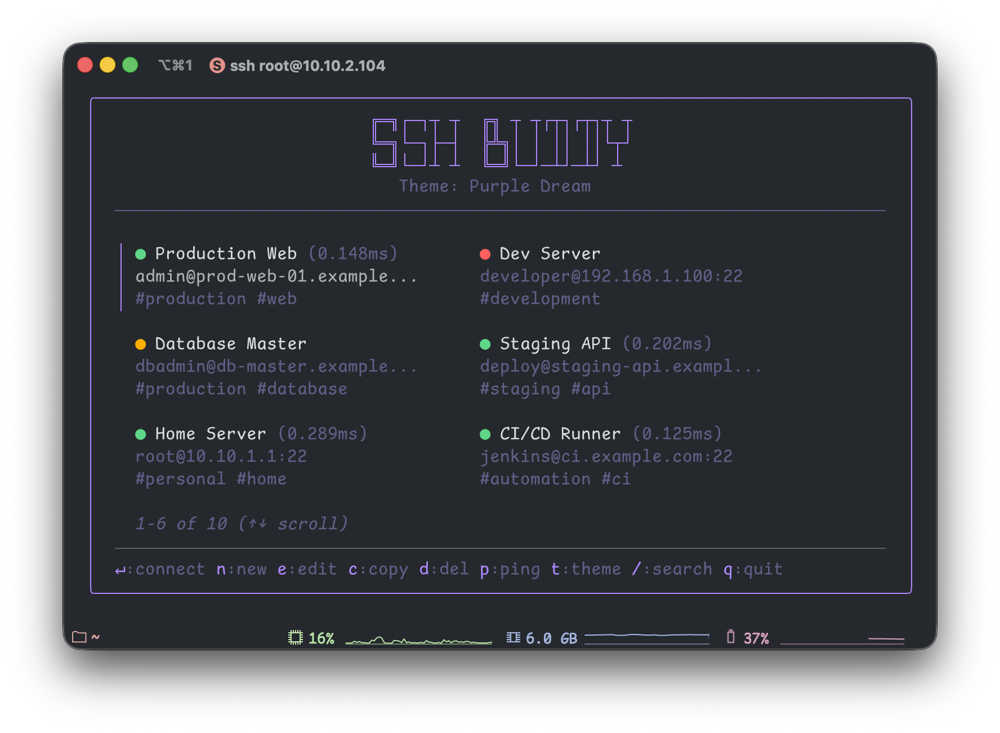
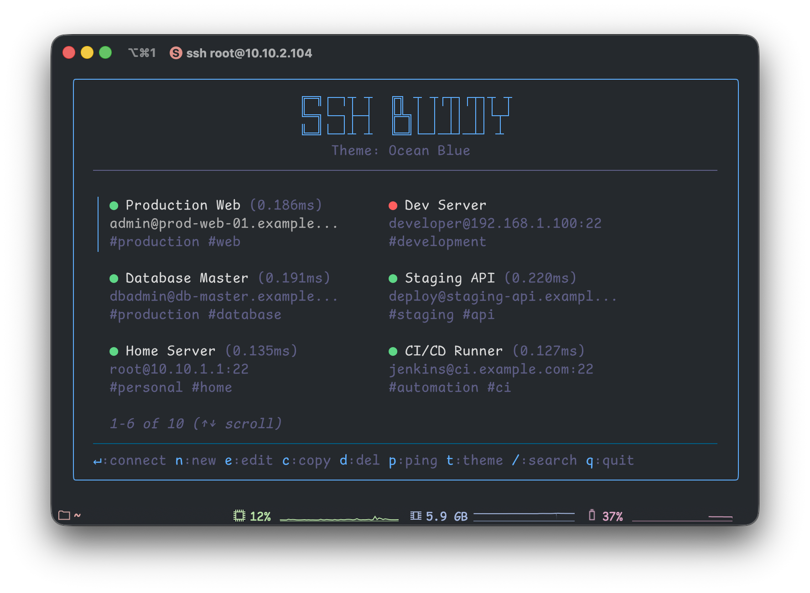
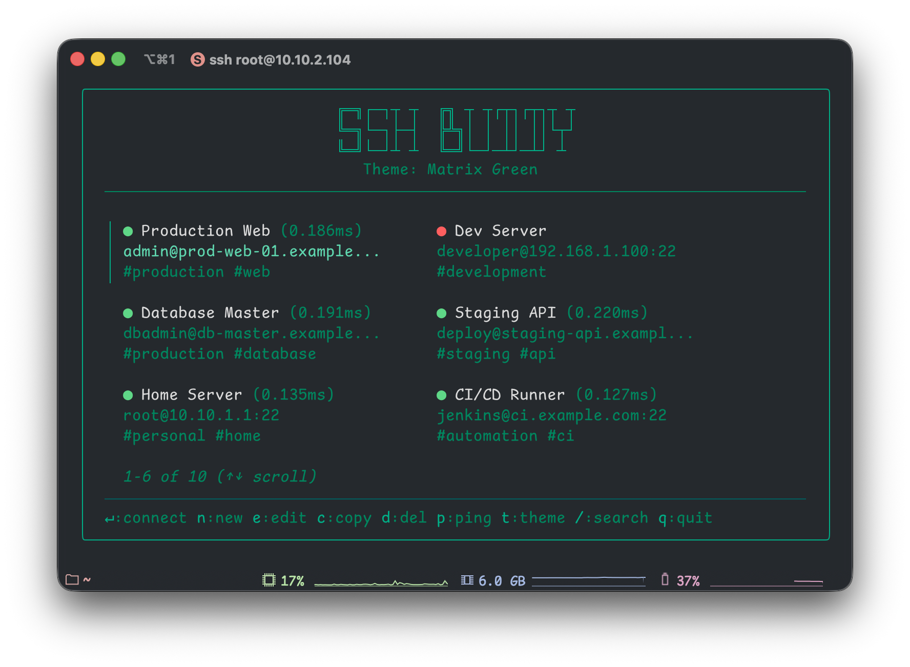
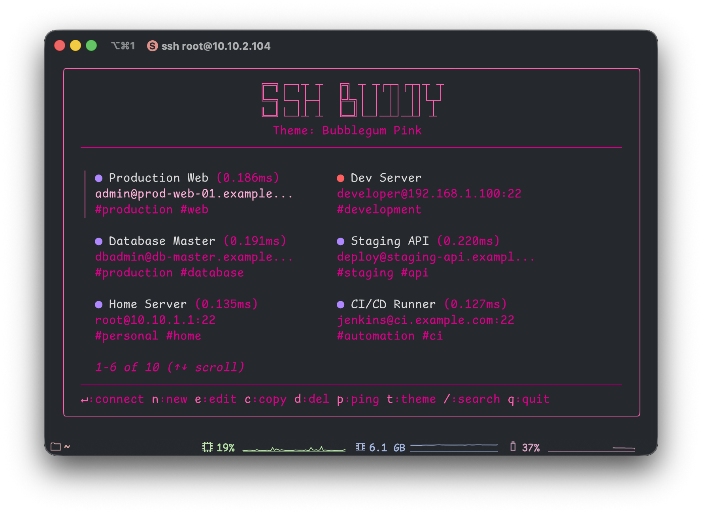
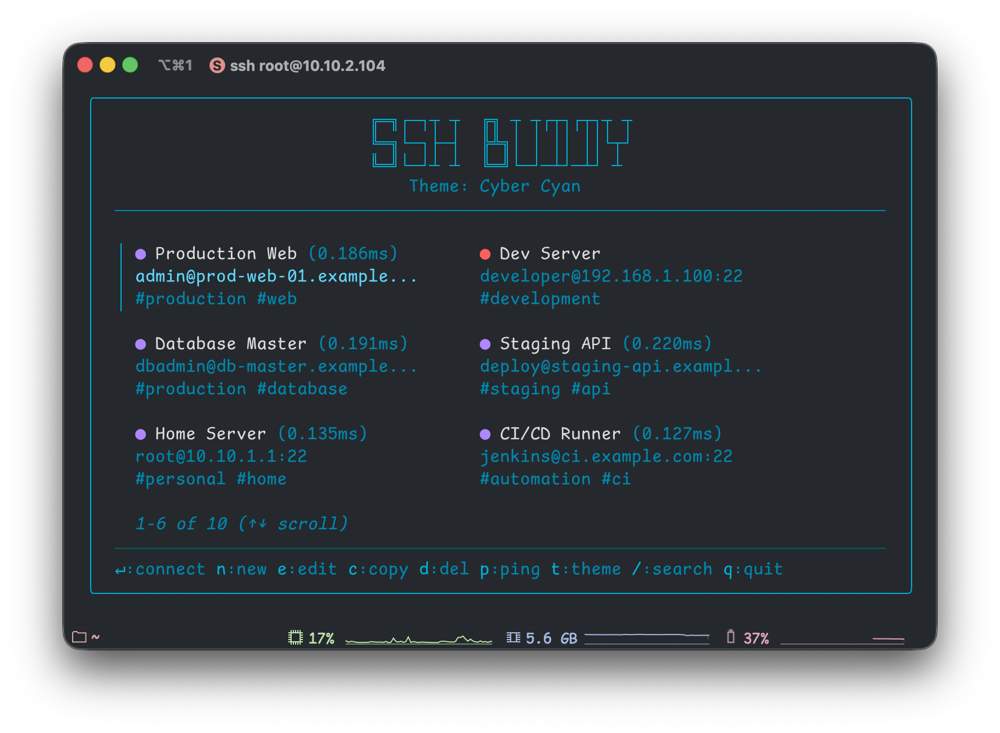

<pre>
╔═╗┌─┐┬ ┬  ╔╗ ┬ ┬┌┬┐┌┬┐┬ ┬
╚═╗└─┐├─┤  ╠╩╗│ │ ││ ││└┬┘
╚═╝└─┘┴ ┴  ╚═╝└─┘─┴┘─┴┘ ┴
</pre>

---

A beautiful TUI app to manage SSH connections with live status indicators, multiple themes, and an intuitive 2-column interface.



## Installation

### Homebrew (macOS/Linux)

```bash
brew tap javedh-dev/tap
brew install sshbuddy
```

### From Source

```bash
git clone https://github.com/javedh-dev/sshbuddy.git
cd sshbuddy
go build .
./sshbuddy
```

### Download Binary

Download the latest release from the [releases page](https://github.com/javedh-dev/sshbuddy/releases).

## Quick Start

1. **Run the app:**
   ```bash
   sshbuddy
   ```

3. **Add a host:**
   - Press `n`
   - Fill in the details
   - Press Enter to save

4. **Connect:**
   - Select a host with arrow keys
   - Press Enter to connect

## Features

- 🟢 **Live ping status indicators** - See which hosts are online at a glance
- 🎨 **Multiple color themes** - 6 beautiful themes to choose from
- 📋 **2-column layout** - View more hosts at once with row-wise display
- 📝 **Duplicate hosts** - Quickly copy existing configurations
- 🏷️ **Host tagging** - Organize hosts with custom tags
- 🔧 **SSH config integration** - Automatically loads hosts from `~/.ssh/config`
- 🔑 **Multiple auth methods** - Support for SSH keys, ProxyJump, and more
- ✨ **Beautiful, modern UI** - Clean and intuitive interface
- ⚡ **Fast and responsive** - Instant feedback and smooth navigation
- 🔍 **Built-in search** - Filter hosts on the fly
- 💾 **Automatic config persistence** - Saved in `~/.config/sshbuddy/config.json`
- ⌨️ **Keyboard-driven** - Navigate without touching the mouse

## Keyboard Shortcuts

| Key | Action |
|-----|--------|
| `Enter` | Connect to selected host |
| `n` | Add new host |
| `e` | Edit selected host |
| `c` | Duplicate/copy selected host |
| `d` | Delete selected host |
| `p` | Ping all hosts |
| `t` | Switch theme |
| `/` | Search/filter hosts |
| `↑`/`↓` | Navigate up/down |
| `←`/`→` | Navigate left/right (between columns) |
| `q` | Quit |
| `Esc` | Cancel (in forms/dialogs) |
| `Ctrl+C` | Force quit |

## Themes

Press `t` to cycle through available themes. Your theme preference is automatically saved.

### Purple Dream (Default)
Soft purple tones for a calm, modern look.


### Ocean Blue
Cool blue tones inspired by the ocean.



### Matrix Green
Classic terminal green for that retro hacker vibe.



### Bubblegum Pink
Vibrant pink for a fun, energetic interface.



### Sunset Amber
Warm amber/orange tones like a beautiful sunset.


### Cyber Cyan
Electric cyan for a futuristic cyberpunk aesthetic.



## Configuration

SSH Buddy stores its configuration in:
- **Linux/Unix**: `~/.config/sshbuddy/config.json`
- **Respects XDG_CONFIG_HOME**: If set, uses `$XDG_CONFIG_HOME/sshbuddy/config.json`

The config file is automatically created on first run and includes:
- Host configurations (alias, hostname, user, port, tags, identity file, proxy jump)
- Theme preference
- All settings are validated on load

### SSH Config Integration

SSH Buddy automatically reads hosts from your `~/.ssh/config` file! Hosts from SSH config are:
- Automatically loaded and displayed alongside manual hosts
- Tagged with `ssh-config` for easy identification
- **Read-only** - edit them in your SSH config file, not in SSH Buddy
- Support advanced SSH features like:
  - Identity files (SSH keys)
  - ProxyJump (bastion hosts)
  - Custom ports
  - And more!

Manual hosts take precedence over SSH config hosts with the same alias.

### Termix API Integration

SSH Buddy can fetch hosts from a Termix API endpoint! To enable:

1. Create `~/.config/sshbuddy/termix.json`:
   ```json
   {
     "enabled": true,
     "baseUrl": "https://your-termix-api.com/api",
     "username": "your-username",
     "password": "your-password"
   }
   ```

2. The API should return a JSON array of hosts from the `/hosts` endpoint:
   ```json
   [
     {
       "id": 1,
       "name": "Server Name",
       "ip": "10.10.1.1",
       "port": 22,
       "username": "root",
       "folder": "category",
       "tags": ["tag1", "tag2"],
       "authType": "key",
       "enableTerminal": true
     }
   ]
   ```

3. Authentication flow:
   - SSH Buddy will authenticate via `POST /auth/login` with username/password
   - The JWT token is returned as a cookie and cached for future requests
   - Automatic re-authentication if the token expires

4. Termix hosts are automatically loaded on startup and marked with source `termix`
5. Manual and SSH config hosts take precedence over Termix hosts with the same alias
6. If the API is unreachable, SSH Buddy will continue to work with local hosts

**Configuration options:**
- `enabled`: Set to `true` to enable Termix integration
- `baseUrl`: Base URL to your Termix API (e.g., `https://api.example.com/api`)
- `username`: Your Termix username for authentication
- `password`: Your Termix password for authentication
- `jwt`: (Auto-managed) Cached JWT token - automatically updated after authentication

### Example Config

```json
{
  "hosts": [
    {
      "alias": "Production Server",
      "hostname": "prod.example.com",
      "user": "admin",
      "port": "22",
      "tags": ["production", "web"],
      "identity_file": "~/.ssh/prod_key",
      "proxy_jump": "bastion.example.com"
    },
    {
      "alias": "Dev Server",
      "hostname": "192.168.1.100",
      "user": "developer",
      "port": "2222",
      "tags": ["development"]
    }
  ],
  "theme": "purple"
}
```

### Authentication Types

SSH Buddy supports multiple authentication methods:
- **Password authentication** - Default SSH behavior
- **Key-based authentication** - Specify an identity file path
- **ProxyJump** - Connect through a bastion/jump host

When adding or editing a host, you can specify:
- **Identity File**: Path to your SSH private key (e.g., `~/.ssh/id_rsa`)
- **Proxy Jump**: Bastion host to jump through (e.g., `bastion.example.com`)

## Tips

- **Quick duplicate**: Press `c` on any host to create a copy with " (copy)" appended to the alias
- **Arrow navigation**: Use arrow keys to navigate the 2-column grid naturally (left/right for columns, up/down for rows)
- **Search**: Press `/` and start typing to filter hosts by alias or hostname
- **Ping status**: Green dot = online, Red dot = offline, Gray dot = unknown, Yellow dot = checking
- **Tags**: Add comma-separated tags when creating/editing hosts for better organization

---

Enjoy managing your SSH connections! 🚀
